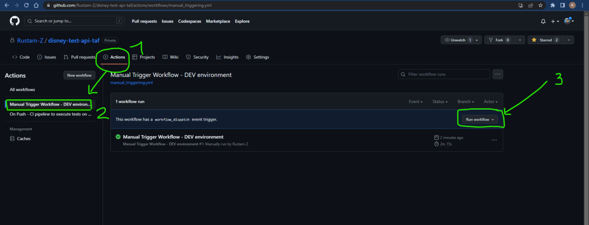

# Disney's API Test Automation Framework


## Links
1. [Disney Postman collection](https://cloudy-spaceship-458806.postman.co/workspace/Disney~a12dcd17-4260-4ca9-98d0-ada0bf3f809f)
2. [Notion Disney Collection](https://www.notion.so/comston/2ca60b96ae994ababcc74007b2256a08?v=a92e71c35ae8499d926d3d0415c27952), to access that you need access to team@comston.app.
3. [YouTube video describing test execution GitHub Actions workflows](https://youtu.be/ruxS4wmWszU)
4. [Test execution reports](https://rustam-z.github.io/disney-test-api-taf/)


## GitHub actions
**Our workflow**

CI pipeline to execute tests on DEV environment, generate Allure test execution report, and send email notification.
Reports are available in https://rustam-z.github.io/disney-test-api-taf/.

**Workflows**
1. `.github/workflows/main.yml` runs after each push to main branch, and sends email only to zokirovrustam202@gmail.com.
2. `.github/workflows/manual_triggering.yml` is triggered manually. 
   Why do we need it? In case we have a PROD hotfix, and before pushing changes to PROD directly, developers need to push changes to DEV, and execute tests in DEV.
   And after verifying that we don't have non critical defects, we can merge hotfix to PROD.
3. `.github/workflows/scheduled.yml` runs daily at 9 AM. And sends emails to zokirovrustam202@gmail.com, madiyor5552@mail.ru, nnarziev@gmail.com.


Steps:
1. Setup: install requirements, and generate config file.
2. Execute tests
3. Copy test execution history report
4. Generate new test execution report
5. Deploy report to GitHub pages
6. Send email notification

Create repository environment variables for running pipeline:
```
DEV_SUPERUSER_EMAIL
DEV_SUPERUSER_PASSWORD
```

**How to execute tests manually within GitHub actions?**




**Sending test report emails**

How to get email password?
1. Go to your Google account and setup two-step verification.
2. Go to https://myaccount.google.com/u/1/apppasswords, and create new app, and copy 16 digit password.

Create repository secrets:
```
MAIL_USERNAME
MAIL_PASSWORD
```

## Setup project locally
1. Install [Python](https://www.python.org/downloads/) >= 3.11 and [Poetry](https://python-poetry.org/docs/).
2. Install PyCharm, clone the project.
3. Create poetry virtual environment and install dependencies: `poetry shell` & `poetry install`.
4. Setup Python interpreter in PyCharm and configure PyTest as test runner in Settings:
   - "Add New Interpreter" → "Add Local Interpreter" → "Poetry environment" → "Existing environment"
   - `[Windows]` Provide the Python path to the virtual environment:
    ```C:\Users\<USER>\AppData\Local\pypoetry\Cache\virtualenvs\ip-manager-taf-api-<HASH>-py3.11\Scripts\python.exe```
5. `.config.yaml` should be created in root of project. Run `generate_config.py` file to generate config file automatically. 
   But you need to have `.env` with SUPERUSER credentials. Use `env-template` to create `.env` file.
   - Or if you want to create data manually use `config-template.yaml` as config file template. You need to create users for facility. To create a user you need to create a role. To create a facility you need to create a customer.


## Configuration 
1. `.config.yaml` includes `API URLs` for DEV, STAGING and PROD envs. 
   - It includes users credentials for superuser, facility admin, facility driver, facility simple user.
   - Superuser -> can control all facilities. Superuser can create a new facility, and facility admin.
   - Facility admin -> can control all users only for his/her facility. 
   - Facility driver -> this type of user, has driver user role.
   - Facility user -> this type of user has no EDIT and VIEW permission, and assigned to autogenerated facility.
   - NOTE! Create facility admin, driver and user by yourself, via Web UI. [TMP SOLUTION]
2. If you change the content and schema of config file, you need to change following files too:
   ```text
   /core/enums/environments.py # The list of env: DEV, STAGING, PROD.
   /core/config/__init__.py # Change this file, if you change the schema of config file.
   /tests/conftest.py # Change PyTest hooks.
   /paths.py # The paths for common project files. Change here if you edit the name of config file.
   ```
   

## How to execute tests locally?
Tests can run in DEV, PROD environments. You can change default running env in `.config.yaml` file that you created. Or provide `--env` flag while executing tests. It will override `CONFIG.env`.
```bash
python -m pytest tests/ -s
python -m pytest --reruns 3 -s --env=dev -v tests/  # Run all available tests.
python -m pytest --reruns 3 -s --env=dev -v -m smoke tests/  # Run all smoke tests. Tests with smoke marker.

# Flags
# `-n auto` = level of parallelism to run multiple tests simultaneously. NOT WORKING TEMPORARY!
# `--reruns 5` = maximum number of times the tests to run if failed.
# - `--reruns-delay 1` = amount of seconds to wait before the next re-run.
# `--lf` or `--last-failed` = to run last failed tests.
# `-v` = verbose, to get more info.
# `-m` = mark expression.
```


## How to generate test execution report locally?
1. [Install JAVA8 JRE](https://www.oracle.com/java/technologies/javase/javase8u211-later-archive-downloads.html#license-lightbox)
2. [Install Allure](https://docs.qameta.io/allure/#_installing_a_commandline)

Execute tests and generate `allure_results` directory using the command below.
```commandline
python -m pytest --reruns 3 -s --env=dev -v --alluredir=.output/allure_results tests/
```
To generate report, execute `generate_test_report.sh`. It will generate test results report in `.output/allure_report` directory.

Or you can manually use the command below, if you don't want to keep the history of test executions.
```commandline
allure generate .output/allure_results -o .output/allure_report --clean
```


## Project structure
```
`\api`: API service layer, contains API related business logic and use cases: API responses & requests models, request endpoints, headers, params.
`\core`: includes framework related helpers: HTTP client, API responses validators, helpers, config, common enums.
`\data`: test data layer.
`\fixtures`: test setup and teardown helpers.
`\tests`: test layer, actual functional API and UI tests.
```


## Models
```text
Request models -> fake request models are inside test data layer.

Response -> all successful and error response models contain status, message, data, error.
SuccessResponse, checks that status is False, data should be object.
ErrorResponse, checks that status is True, error should be object.

Common responses models in common_models.py. Ex: AuthErrorResponse.
    
Other response models are created for successful responses per API.
```


## Response validation plan
1. Validate HTTP status code
2. Validate schema: convert response.json() to pydantic model to check data types, and verify that all fields are present. 
   - `status` field content is checked via pydantic `SuccessResponse` and `ErrorResponse`.
   - `error` schema is NOT validated for all responses, as it is not defined, and generated by backend framework.
   - But we validate common error responses such as authorization errors, wrong path errors.
   - **TODO: `message` is not validated separately yet for success, error. It will be done in the future, when backend will support this feature.**
3. Validate data, and assert result with expected.


## How to write tests?
- CREATE
  - Create with/without superuser 
  - Happy path with valid data
  - Negative test cases with wrong data
  - Test Authz: people who don't have access
- UPDATE
  - Update with/without superuser
  - Happy path with valid data and existing ID
  - Negative test cases with wrong data 
  - Negative test case with not existing ID
  - Test Authz: people who don't have access
- GET DETAIL
  - Get with/without superuser
  - Happy path with existing ID
  - Negative test case with not existing ID
  - Test Authz: people who don't have access
- GET ALL
  - get_all_* but populate with data before fetching and validate if data is there
  - test pagination in get_all_*
- DELETE
  - Delete with/without superuser
  - Happy path: delete existing object, and delete one more time in the same test
  - Delete not existing as separate test
  - Test Authz: people who don't have access
- Auths: test all endpoints with User.NONE
- Endpoints with section
  - All positive cases, should include the section. Web and mobile always use section param.
  - So, tests without section param will be considered as NEGATIVE.

```text
1. @mobile() # Fixture for mobile which uses `/?is_for_mobile=true`
2. @users() # Authentication -> auth, unauth requests.
```

## TODO
- What if the script can be crated to populate the database with data, session setup and session teardown.
  - It can be used by fixtures to make the setup and teardown faster.
  - The fixtures will use get_all_* instead of creation. We don't need local teardown. OR we can create some config file?
  - It is like global caching.
- Fixtures: Superuser creates smth class, pass facility id if needed, if not passed then facility will be created too.
